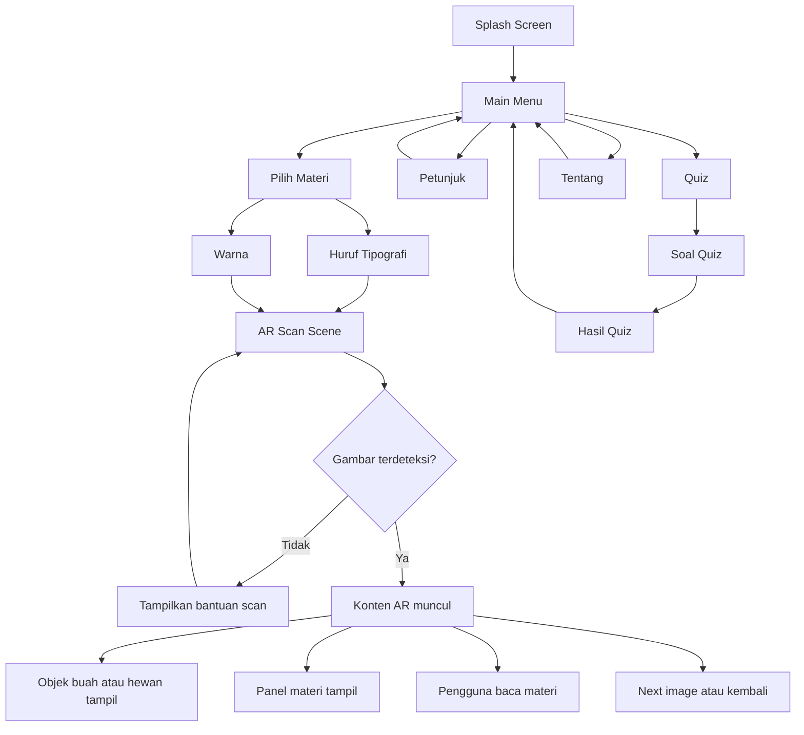

# AR Project UJIKOM — Media Pembelajaran Tipografi dan Warna Berbasis AR

## 1. Identitas Proyek

**Judul proyek:** Perancangan Media Pembelajaran Tipografi dan Warna Berbasis Augmented Reality sebagai Pendukung Pembelajaran Desain Grafis Percetakan  
**Kategori UJIKOM:** Desain Grafis Percetakan  
**Platform target:** Android  
**Unity Editor:** Unity 6.4  
**Framework AR:** AR Foundation  
**Android runtime:** ARCore  
**Tracking approach:** Tracked Image / Image Tracking  
**Fokus materi:** Huruf tipografi dan warna  
**Objek visual AR:** Buah-buahan dan hewan  
**Target pengguna:** Siswa SD akhir, SMP, pemula desain, guru, dan penguji UJIKOM

Proyek ini adalah aplikasi Android berbasis AR yang memindai media cetak, lalu menampilkan konten edukasi tentang **tipografi** dan **warna**. Objek yang muncul di AR bukan menjadi materi utama tersendiri, melainkan **media visual pendukung** berupa **buah-buahan** dan **hewan** agar konsep huruf dan warna lebih konkret, menarik, dan mudah dipahami.

Arah ini paling aman untuk UJIKOM karena:

- materi tidak terlalu luas,
- pembahasan tetap kuat di bidang desain grafis percetakan,
- AR dipakai sebagai pendukung presentasi materi,
- build Unity lebih realistis untuk diselesaikan.

---

## 2. Koreksi Scope Materi

Ruang materi direvisi menjadi lebih sempit dan terkontrol.

### Materi utama

1. **Huruf Tipografi**
2. **Warna**

### Objek visual pendukung

1. **Buah-buahan**
2. **Hewan**

Artinya:

- **buah dan hewan bukan kategori materi utama**, 
- buah dan hewan hanya dipakai sebagai **objek 3D/2D AR** untuk membantu penjelasan warna, bentuk visual, karakter huruf, dan asosiasi desain,
- menu aplikasi cukup fokus ke dua topik utama agar tidak terlalu banyak halaman dan asset.

Contoh penerapan:

- materi warna menampilkan **apel, jeruk, pisang, anggur** untuk mengenalkan warna dominan,
- materi warna menampilkan **burung, kupu-kupu, ikan** untuk menunjukkan kontras dan harmoni warna,
- materi tipografi dapat menampilkan label huruf dengan gaya berbeda di atas objek AR,
- objek buah/hewan menjadi elemen visual agar pembelajaran tidak terasa kaku.

---

## 3. Latar Belakang Masalah

Pembelajaran dasar desain grafis sering berhenti di teori, padahal siswa lebih cepat memahami materi ketika melihat contoh visual yang nyata. Pada topik **huruf tipografi** dan **warna**, kendala yang sering muncul adalah:

- huruf hanya dipahami sebagai tulisan biasa, bukan elemen desain,
- siswa sulit membedakan karakter visual beberapa jenis huruf,
- teori warna terasa abstrak jika hanya dijelaskan melalui teks,
- media cetak informatif tetapi kurang interaktif,
- pembelajaran cepat membosankan jika tidak ada visual yang bergerak.

Solusi yang diambil adalah membuat media pembelajaran berbasis AR yang tetap berakar pada **desain grafis percetakan**. Pengguna memindai kartu/poster cetak, lalu aplikasi menampilkan objek AR dan panel materi singkat untuk menjelaskan konsep tipografi dan warna.

---

## 4. Tujuan Proyek

### 4.1 Tujuan Umum

Membuat aplikasi pembelajaran berbasis AR untuk membantu pengguna memahami **huruf tipografi** dan **warna** secara visual, ringkas, dan interaktif.

### 4.2 Tujuan Khusus

- Menjelaskan pengertian dasar tipografi.
- Menjelaskan jenis dan karakter huruf.
- Menjelaskan dasar warna dalam desain.
- Menunjukkan contoh warna melalui objek buah dan hewan.
- Menghasilkan media cetak dan aplikasi AR yang saling terhubung.
- Menampilkan hasil kerja yang relevan dengan kompetensi Desain Grafis Percetakan.

---

## 5. Value Proposition

Nilai kuat proyek ini ada pada beberapa hal berikut:

- **Fokus materi jelas:** hanya tipografi dan warna.
- **Tetap kreatif:** objek buah dan hewan membuat demo lebih hidup.
- **Relevan dengan jurusan:** ada media cetak, layout, tipografi, warna, dan output digital.
- **Layak dibangun di Unity:** asset dan scene tidak terlalu melebar.
- **Mudah dipresentasikan:** penguji langsung melihat hubungan antara poster cetak dan hasil AR.

---

## 6. Ruang Lingkup Proyek

### 6.1 In Scope

- Splash screen
- Main menu
- Halaman petunjuk
- Halaman pilih materi
- Halaman scan AR
- Overlay panel informasi
- Materi **Huruf Tipografi**
- Materi **Warna**
- Objek AR pendukung: buah dan hewan
- Kuis sederhana
- Halaman tentang aplikasi
- Build APK Android offline

### 6.2 Out of Scope

- Materi buah sebagai bab pembelajaran tersendiri
- Materi hewan sebagai bab pembelajaran tersendiri
- Backend/server
- Login akun
- Penyimpanan cloud
- Multiplayer
- Leaderboard online
- Gesture kompleks
- Mini game besar
- Model 3D berat berlebihan

### 6.3 MVP Minimum

Versi minimum yang realistis:

- 1 APK Android stabil
- 1 main menu
- 2 materi utama: **Tipografi** dan **Warna**
- 4 reference image aktif
- 4–8 objek AR pendukung
- 1 panel materi dinamis
- 1 kuis sederhana

### 6.4 Versi Ideal

- 6–8 reference image aktif
- animasi ringan pada objek AR
- audio singkat opsional
- transisi UI rapi
- panel materi dengan tombol next/prev

---

## 7. Target Pengguna

### 7.1 Target Utama

- Siswa usia 11–16 tahun
- Pemula desain grafis
- Guru/pembimbing
- Penguji UJIKOM

### 7.2 Persona

#### Persona A — Siswa Pemula
- Lebih mudah memahami visual daripada teori panjang
- Ingin aplikasi yang sederhana dan cepat dipakai
- Menyukai objek yang familiar seperti buah dan hewan

#### Persona B — Penguji / Pembimbing
- Ingin melihat keterkaitan karya cetak dan aplikasi
- Menilai kerapian konsep, UI, UX, dan implementasi
- Mengutamakan kestabilan dan kejelasan demo

---

## 8. Learning Outcome

Setelah menggunakan aplikasi, pengguna diharapkan dapat:

### 8.1 Materi Huruf Tipografi

- memahami pengertian tipografi,
- mengenali fungsi huruf dalam desain,
- membedakan beberapa jenis huruf,
- memahami karakter visual huruf,
- memahami dasar keterbacaan pada media cetak.

### 8.2 Materi Warna

- memahami pengertian warna,
- mengenali warna primer dan sekunder,
- memahami warna hangat dan dingin,
- memahami kontras dan harmoni,
- mengetahui hubungan warna dengan objek nyata.

### 8.3 Penguatan Visual

- mengamati warna dominan pada buah dan hewan,
- melihat bagaimana warna memberi kesan visual,
- memahami bahwa pemilihan huruf dan warna memengaruhi pesan desain.

---

## 9. Struktur Materi

## 9.1 Materi Utama A — Huruf Tipografi

Submateri yang disarankan:

1. Pengertian tipografi  
2. Fungsi huruf dalam desain  
3. Jenis huruf dasar  
4. Karakter visual huruf  
5. Keterbacaan sederhana

### Isi ringkas per submateri

#### 1. Pengertian tipografi
Tipografi adalah seni dan teknik mengatur huruf agar mudah dibaca dan memiliki nilai visual.

#### 2. Fungsi huruf dalam desain
Huruf berfungsi menyampaikan informasi, membentuk identitas, dan memberi kesan tertentu pada desain.

#### 3. Jenis huruf dasar
- **Serif** → formal, klasik
- **Sans Serif** → modern, bersih
- **Script** → dekoratif, luwes
- **Display** → unik, menonjol

#### 4. Karakter visual huruf
Setiap jenis huruf punya nuansa berbeda. Huruf yang tepat membantu pesan desain lebih kuat.

#### 5. Keterbacaan sederhana
Huruf harus mudah dibaca dari segi ukuran, warna, kontras, dan jarak.

## 9.2 Materi Utama B — Warna

Submateri yang disarankan:

1. Pengertian warna  
2. Warna primer dan sekunder  
3. Warna hangat dan dingin  
4. Kontras warna  
5. Harmoni warna

### Isi ringkas per submateri

#### 1. Pengertian warna
Warna adalah unsur visual yang memberi identitas, suasana, dan daya tarik pada desain.

#### 2. Warna primer dan sekunder
- Primer: merah, kuning, biru
- Sekunder: hasil campuran dua warna primer

#### 3. Warna hangat dan dingin
- Hangat: merah, oranye, kuning
- Dingin: biru, hijau, ungu

#### 4. Kontras warna
Kontras membuat objek lebih jelas dan menarik perhatian.

#### 5. Harmoni warna
Harmoni warna membuat tampilan lebih serasi dan enak dilihat.

## 9.3 Objek AR Pendukung

Objek ini **bukan materi utama**, tetapi dipakai sebagai contoh visual.

### Buah-buahan
- Apel
- Jeruk
- Pisang
- Anggur

### Hewan
- Kupu-kupu
- Ikan badut
- Burung beo
- Kucing

### Fungsi objek pendukung

- memperjelas warna dominan,
- memberi contoh warna alami,
- membuat visual AR lebih menarik,
- membantu siswa mengingat materi.

---

## 10. Konsep Produk

Produk terdiri dari dua komponen utama:

### 10.1 Media Cetak

Media cetak dapat berupa:

- poster edukasi,
- kartu materi,
- lembar pembelajaran.

Isi media cetak mencakup:

- judul materi,
- ilustrasi,
- layout tipografi,
- blok warna,
- gambar referensi untuk AR tracking.

### 10.2 Aplikasi Android AR

Aplikasi akan:

- membuka kamera,
- membaca gambar referensi,
- memunculkan objek AR,
- menampilkan panel materi sesuai gambar yang dipindai.

---

## 11. UX Strategy

Aplikasi harus sederhana, cepat dipahami, dan tidak melelahkan saat demo.

### 11.1 Prinsip UX

- pengguna harus bisa mulai scan dalam maksimal 3 langkah,
- tiap layar hanya punya satu fokus utama,
- teks harus singkat,
- kamera AR harus dominan di layar scan,
- informasi tambahan tampil sebagai overlay, bukan halaman yang memutus flow,
- buah dan hewan muncul sebagai pendukung visual, bukan membuat pengguna bingung seolah itu materi terpisah.

### 11.2 UX Goals

- pengguna tahu fungsi aplikasi dalam 10 detik pertama,
- pengguna tahu bahwa ada dua materi utama,
- pengguna paham bahwa objek buah/hewan hanya contoh visual,
- pengguna bisa kembali ke menu tanpa tersesat.

### 11.3 Pain Point yang Harus Dihindari

- kategori materi terlalu banyak,
- menu berlapis-lapis,
- teks kepanjangan di halaman scan,
- objek muncul tanpa penjelasan,
- tombol kecil atau tidak konsisten,
- status tracking tidak jelas.

---

## 12. UI Strategy

### 12.1 Arah Visual

Gaya visual yang tepat:

- edukatif,
- bersih,
- modern,
- ringan,
- tidak terlalu childish,
- tetap terasa sebagai proyek desain grafis.

### 12.2 Palet UI

Saran arah warna UI:

- background: putih / off-white,
- primary button: biru muda / cyan,
- accent: kuning atau oranye,
- info panel: putih transparan atau gelap transparan,
- warna materi: mengikuti warna primer dan sekunder.

### 12.3 Font UI

Saran:

- heading: Poppins / Montserrat / Nunito Bold
- body: Inter / Open Sans / Nunito Regular
- font dekoratif hanya dipakai untuk contoh materi tipografi, bukan seluruh UI

### 12.4 Komponen UI Utama

- button
- card materi
- top bar
- panel informasi
- badge status scan
- quiz option button
- modal bantuan

---

## 13. Information Architecture

Struktur aplikasi:

1. Splash Screen
2. Main Menu
3. Petunjuk
4. Pilih Materi
5. Scan AR
6. Overlay Materi
7. Quiz
8. Hasil Quiz
9. Tentang

Relasi halaman:

- Main Menu → Pilih Materi
- Main Menu → Petunjuk
- Main Menu → Quiz
- Main Menu → Tentang
- Pilih Materi → Scan AR
- Scan AR → Overlay Materi
- Quiz → Hasil Quiz → Main Menu

---

## 14. UI Flow



---

## 15. User Flow Detail

### 15.1 Alur Utama

1. Pengguna membuka aplikasi.
2. Splash screen tampil.
3. Masuk ke main menu.
4. Pengguna menekan **Mulai Belajar**.
5. Masuk ke halaman **Pilih Materi**.
6. Pengguna memilih **Huruf Tipografi** atau **Warna**.
7. Aplikasi membuka scene AR.
8. Kamera aktif dan instruksi scan tampil.
9. Pengguna memindai kartu/poster.
10. Unity mendeteksi reference image.
11. Objek AR buah/hewan dan panel materi muncul.
12. Pengguna membaca materi.
13. Pengguna dapat memindai gambar lain atau kembali ke menu.

### 15.2 Alur Gagal Deteksi

Jika gambar belum terbaca:

- tampilkan teks: **Arahkan kamera ke gambar referensi**,
- tampilkan tips pencahayaan,
- tampilkan tips jarak,
- tampilkan bantuan kecil berupa ikon atau popup.

### 15.3 Alur Kehilangan Tracking

Jika tracking hilang:

- objek bisa disembunyikan,
- atau objek dipertahankan sebentar lalu fade out,
- panel memberi status: **Tracking hilang, arahkan kembali kamera ke gambar**.

---

## 16. Desain Halaman

## 16.1 Splash Screen

### Fungsi
Menampilkan identitas aplikasi.

### Elemen
- logo aplikasi,
- nama aplikasi,
- nama pembuat/sekolah opsional,
- animasi fade sederhana.

### Catatan
- durasi 2–3 detik,
- tanpa interaksi.

## 16.2 Main Menu

### Elemen
- logo / judul aplikasi,
- tombol **Mulai Belajar**,
- tombol **Petunjuk**,
- tombol **Quiz**,
- tombol **Tentang**,
- tombol **Keluar**.

### Layout
- header di atas,
- tombol vertikal di tengah,
- versi aplikasi kecil di bawah.

## 16.3 Petunjuk

### Isi
1. Pilih materi  
2. Arahkan kamera ke gambar  
3. Tunggu objek AR muncul  
4. Baca materi yang tampil

### Elemen
- ikon langkah,
- teks singkat,
- tombol kembali.

## 16.4 Pilih Materi

### Hanya dua card utama
- **Huruf Tipografi**
- **Warna**

### Isi card
- ikon,
- judul,
- deskripsi singkat,
- tombol pilih.

### Catatan
Jangan buat card buah/hewan di halaman ini karena itu akan memperlebar scope dan membingungkan struktur materi.

## 16.5 Scan AR

### Fungsi
Layar utama pengalaman AR.

### Elemen
- camera feed fullscreen,
- top bar,
- tombol kembali,
- status tracking,
- frame guide scan,
- tombol bantuan,
- panel info kecil,
- tombol buka/tutup info.

### Perilaku
- saat gambar belum terdeteksi, tampilkan panduan,
- saat terdeteksi, munculkan objek AR + panel materi,
- panel info bisa collapse agar kamera tetap dominan.

## 16.6 Quiz

### Isi
- 5 sampai 10 soal singkat,
- pilihan ganda,
- skor sederhana.

### Fokus soal
- jenis huruf,
- karakter huruf,
- warna primer/sekunder,
- warna hangat/dingin,
- contoh warna pada objek.

## 16.7 Tentang

### Isi
- deskripsi singkat aplikasi,
- tujuan proyek,
- nama pembuat,
- sekolah,
- teknologi yang dipakai.

---

## 17. Konsep Konten AR

## 17.1 Prinsip Konten

Konten AR harus menampilkan dua lapisan:

1. **objek visual pendukung**,
2. **informasi materi utama**.

Jadi, ketika kamera membaca suatu image target, yang muncul bisa berupa:

- model buah/hewan,
- label judul materi,
- penjelasan singkat,
- highlight warna,
- contoh teks/huruf.

## 17.2 Contoh Mapping Konten

### Materi Tipografi

#### Image Target 1 — Serif
- objek pendukung: kucing atau burung dengan label bergaya serif,
- panel: penjelasan bahwa serif memberi kesan klasik/formal.

#### Image Target 2 — Sans Serif
- objek pendukung: ikan atau apel dengan label sans serif,
- panel: penjelasan bahwa sans serif terasa bersih dan modern.

#### Image Target 3 — Script
- objek pendukung: kupu-kupu dengan tulisan script,
- panel: penjelasan bahwa script dekoratif dan luwes.

#### Image Target 4 — Display
- objek pendukung: buah dengan teks display yang menonjol,
- panel: penjelasan bahwa display dipakai untuk menarik perhatian.

### Materi Warna

#### Image Target 5 — Warna Hangat
- objek pendukung: apel, jeruk, pisang,
- panel: merah, oranye, kuning memberi kesan hangat dan energik.

#### Image Target 6 — Warna Dingin
- objek pendukung: burung atau ikan bernuansa biru/hijau,
- panel: warna dingin memberi kesan tenang dan segar.

#### Image Target 7 — Kontras Warna
- objek pendukung: ikan badut atau kupu-kupu,
- panel: kontras membantu objek menonjol dan mudah dilihat.

#### Image Target 8 — Harmoni Warna
- objek pendukung: anggur atau burung dengan warna serasi,
- panel: harmoni memberi kesan seimbang dan nyaman.

---

## 18. Desain Media Cetak

Media cetak sebaiknya tetap menjadi bukti utama kompetensi percetakan.

### 18.1 Bentuk yang Disarankan

- 1 poster utama ukuran A3 atau A4,
- atau 6–8 kartu materi,
- atau kombinasi 1 poster + beberapa kartu.

### 18.2 Elemen pada Media Cetak

- judul materi,
- layout rapi,
- penggunaan tipografi yang jelas,
- warna yang sesuai materi,
- gambar referensi bertekstur kuat agar mudah dilacak AR,
- identitas visual aplikasi.

### 18.3 Catatan Penting untuk Image Tracking

Agar reference image mudah dikenali AR Foundation:

- gunakan gambar dengan detail cukup,
- hindari gambar terlalu polos,
- hindari area warna datar terlalu luas,
- pastikan ada kontras dan tekstur,
- gunakan ukuran cetak yang cukup jelas,
- uji di pencahayaan normal.

---

## 19. Arsitektur Teknis Unity

## 19.1 Tech Stack

- Unity 6.4
- AR Foundation
- ARCore XR Plugin
- XR Plugin Management
- TextMeshPro
- Unity UI (uGUI)
- ScriptableObject untuk data materi

## 19.2 Scene Structure

### 1. `SplashScene`
Isi:
- logo,
- animator atau coroutine pindah scene.

### 2. `MainMenuScene`
Isi:
- canvas menu,
- tombol navigasi.

### 3. `GuideScene`
Isi:
- panel petunjuk.

### 4. `MaterialSelectScene`
Isi:
- card **Tipografi**,
- card **Warna**.

### 5. `ARScanScene`
Isi:
- `AR Session`,
- `AR Session Origin / XR Origin`,
- `AR Camera`,
- `AR Tracked Image Manager`,
- canvas overlay,
- content spawner.

### 6. `QuizScene`
Isi:
- soal,
- opsi jawaban,
- skor.

### 7. `ResultScene`
Isi:
- nilai,
- feedback,
- tombol ulang / kembali.

### 8. `AboutScene`
Isi:
- deskripsi aplikasi.

---

## 20. Hierarchy ARScanScene

Contoh hierarchy:

```text
ARScanScene
├── XR Origin
│   └── AR Camera
├── AR Session
├── Directional Light
├── AR Managers
│   ├── ARTrackedImageManager
│   └── ARRaycastManager (opsional)
├── ContentRoot
│   ├── SpawnedObjects
│   └── UIFollowObjects (opsional)
├── Canvas_Overlay
│   ├── TopBar
│   ├── StatusText
│   ├── HelpButton
│   ├── BackButton
│   ├── InfoPanel
│   │   ├── MaterialTitle
│   │   ├── MaterialSubtitle
│   │   ├── MaterialDescription
│   │   └── CloseInfoButton
│   └── ScanGuideFrame
└── Managers
    ├── ARImageTrackingController
    ├── MaterialContentController
    ├── UIOverlayController
    └── SceneNavigationController
```

---

## 21. Struktur Data dan Script

## 21.1 ScriptableObject Data Materi

Buat satu `ScriptableObject` untuk menyimpan data materi.

### Contoh field

```text
MaterialContentData
- string id
- string category            // Typography / Color
- string title
- string subtitle
- string description
- Sprite thumbnail
- GameObject prefab
- AudioClip voiceOver        // opsional
- string referenceImageName
- string objectType          // Fruit / Animal
- string colorFocus
- string fontTypeFocus
```

## 21.2 Script yang Disarankan

### `ARImageTrackingController.cs`
Tugas:
- mendeteksi image tracking,
- spawn/hide prefab,
- kirim ID konten ke UI.

### `MaterialContentController.cs`
Tugas:
- memetakan image target ke data materi,
- memilih prefab dan info panel yang benar.

### `UIOverlayController.cs`
Tugas:
- update judul,
- update deskripsi,
- tampil/sembunyi panel,
- update status tracking.

### `SceneNavigationController.cs`
Tugas:
- pindah scene,
- kembali ke main menu,
- buka quiz atau guide.

### `QuizManager.cs`
Tugas:
- menampilkan soal,
- menghitung skor,
- mengelola hasil.

---

## 22. Alur Logika Sistem AR

1. `ARTrackedImageManager` mendeteksi reference image.
2. Sistem membaca nama image target.
3. Nama target dicocokkan dengan data pada `MaterialContentData`.
4. Prefab buah/hewan yang sesuai dimunculkan.
5. Panel materi di-update dengan judul dan penjelasan.
6. Jika tracking hilang, objek dan panel disesuaikan.

Pseudo flow:

```text
trackedImage detected
→ get reference image name
→ search matching MaterialContentData
→ spawn/update prefab
→ update UI panel
→ maintain tracking state
```

---

## 23. Mapping Reference Image yang Disarankan

| Reference Image | Materi Utama | Fokus | Objek AR |
|---|---|---|---|
| typo_serif | Tipografi | Serif | Kucing / Burung |
| typo_sans | Tipografi | Sans Serif | Apel / Ikan |
| typo_script | Tipografi | Script | Kupu-kupu |
| typo_display | Tipografi | Display | Jeruk / Buah dekoratif |
| color_warm | Warna | Warna Hangat | Apel, Jeruk, Pisang |
| color_cool | Warna | Warna Dingin | Burung / Ikan |
| color_contrast | Warna | Kontras | Ikan badut / Kupu-kupu |
| color_harmony | Warna | Harmoni | Anggur / Burung |

---

## 24. Asset List

## 24.1 Asset 2D

- logo aplikasi,
- icon menu,
- background,
- card materi,
- panel UI,
- ilustrasi petunjuk,
- thumbnail materi,
- reference images cetak.

## 24.2 Asset 3D / Visual AR

- apel,
- jeruk,
- pisang,
- anggur,
- kupu-kupu,
- ikan,
- burung,
- kucing.

Boleh berupa:

- model 3D low poly,
- sprite 2.5D,
- layered illustration ringan.

## 24.3 Audio Opsional

- klik tombol,
- suara notifikasi deteksi,
- voice over singkat.

---

## 25. Struktur Folder Unity

```text
Assets/
├── Art/
│   ├── UI/
│   ├── Icons/
│   ├── Posters/
│   └── ReferenceImages/
├── Audio/
├── Materials/
├── Models/
│   ├── Fruits/
│   └── Animals/
├── Prefabs/
│   ├── ARObjects/
│   └── UI/
├── Scenes/
│   ├── SplashScene.unity
│   ├── MainMenuScene.unity
│   ├── GuideScene.unity
│   ├── MaterialSelectScene.unity
│   ├── ARScanScene.unity
│   ├── QuizScene.unity
│   ├── ResultScene.unity
│   └── AboutScene.unity
├── Scripts/
│   ├── AR/
│   ├── UI/
│   ├── Data/
│   ├── Quiz/
│   └── Core/
├── ScriptableObjects/
└── XR/
```

---

## 26. Kuis

### 26.1 Tujuan Kuis

Mengukur apakah pengguna memahami materi dasar setelah mencoba AR.

### 26.2 Tema Soal

- jenis huruf serif dan sans serif,
- fungsi tipografi,
- warna primer,
- warna hangat dan dingin,
- contoh kontras warna,
- contoh warna alami pada buah/hewan.

### 26.3 Contoh Soal

1. Huruf serif biasanya memberi kesan apa?  
2. Warna primer terdiri dari warna apa saja?  
3. Warna merah dan kuning termasuk warna apa?  
4. Objek manakah yang cocok untuk contoh warna kontras?  
5. Huruf sans serif biasanya terlihat seperti apa?

---

## 27. Build Settings Android

### 27.1 Target Platform

- Android

### 27.2 Paket dan XR

- aktifkan **XR Plugin Management**,
- aktifkan **ARCore**,
- pasang **AR Foundation**,
- pasang **ARCore XR Plugin**.

### 27.3 Saran Package Name

- `com.z7.artigraf`
- `com.z7.typocolorar`
- `com.z7.cetakar`

### 27.4 Saran Nama APK

Nama APK yang cocok:

- **ARtiGraf**
- **TypoColor AR**
- **CETAKAR**
- **HurufWarna AR**
- **Grafika AR Edu**

### 27.5 Rekomendasi Utama

**ARtiGraf** paling kuat karena:

- singkat,
- mudah diingat,
- ada nuansa AR dan grafika,
- tidak terlalu generik,
- cocok untuk project UJIKOM desain grafis.

---

## 28. Acceptance Criteria

Proyek dianggap selesai jika:

- aplikasi bisa dibuka tanpa crash,
- main menu berfungsi,
- hanya ada dua materi utama yang jelas,
- reference image dapat terdeteksi,
- objek buah/hewan muncul sesuai target,
- panel materi tampil sesuai konteks,
- quiz bisa dijalankan,
- build APK dapat dipasang di Android.

---

## 29. Testing Checklist

### 29.1 Functional Test

- [ ] Splash screen tampil
- [ ] Semua tombol menu berfungsi
- [ ] Navigasi antar scene normal
- [ ] Kamera AR terbuka
- [ ] Reference image dikenali
- [ ] Objek AR muncul sesuai target
- [ ] Panel materi sesuai dengan target
- [ ] Tracking hilang ditangani dengan benar
- [ ] Quiz menghitung skor dengan benar
- [ ] APK dapat di-install

### 29.2 UX Test

- [ ] Pengguna paham ada dua materi utama
- [ ] Pengguna tidak mengira buah/hewan adalah menu materi terpisah
- [ ] Teks mudah dibaca
- [ ] Tombol cukup besar
- [ ] Kamera tetap dominan pada layar AR

### 29.3 Visual Test

- [ ] Layout rapi
- [ ] Warna UI konsisten
- [ ] Font sesuai tema
- [ ] Panel tidak menutupi objek terlalu banyak
- [ ] Media cetak mudah dilacak

---

## 30. Risiko dan Mitigasi

| Risiko | Dampak | Mitigasi |
|---|---|---|
| Scope terlalu luas | Project tidak selesai | Batasi ke 2 materi utama |
| Gambar sulit dideteksi | Demo gagal | Gunakan image referensi dengan detail tinggi |
| Model 3D terlalu berat | APK lag | Gunakan low poly atau sprite 2.5D |
| UI terlalu ramai | Pengguna bingung | Fokus ke tombol inti dan panel singkat |
| Materi terlalu panjang | Siswa bosan | Tulis materi ringkas, 2–4 kalimat per target |

---

## 31. Rekomendasi Implementasi

Urutan build yang paling efisien:

1. Buat struktur scene.  
2. Selesaikan main menu dan navigasi.  
3. Setup AR Foundation dan ARCore.  
4. Buat XR Reference Image Library.  
5. Implement `ARTrackedImageManager`.  
6. Tampilkan prefab berdasarkan image target.  
7. Hubungkan panel materi dengan data.  
8. Tambahkan quiz.  
9. Rapikan UI.  
10. Testing di device Android.

---

## 32. Kesimpulan Desain Revisi

Versi revisi ini jauh lebih tepat untuk dibangun karena struktur proyek menjadi jelas:

- **materi utama hanya dua:** huruf tipografi dan warna,
- **buah dan hewan hanya objek AR pendukung**, 
- **UI lebih sederhana**, 
- **scene lebih sedikit**, 
- **konten lebih fokus**, 
- **relevansi ke Desain Grafis Percetakan tetap kuat**.

Dengan struktur ini, aplikasi tidak terasa terlalu luas, tetapi tetap punya nilai visual yang menarik saat diuji atau dipresentasikan.
