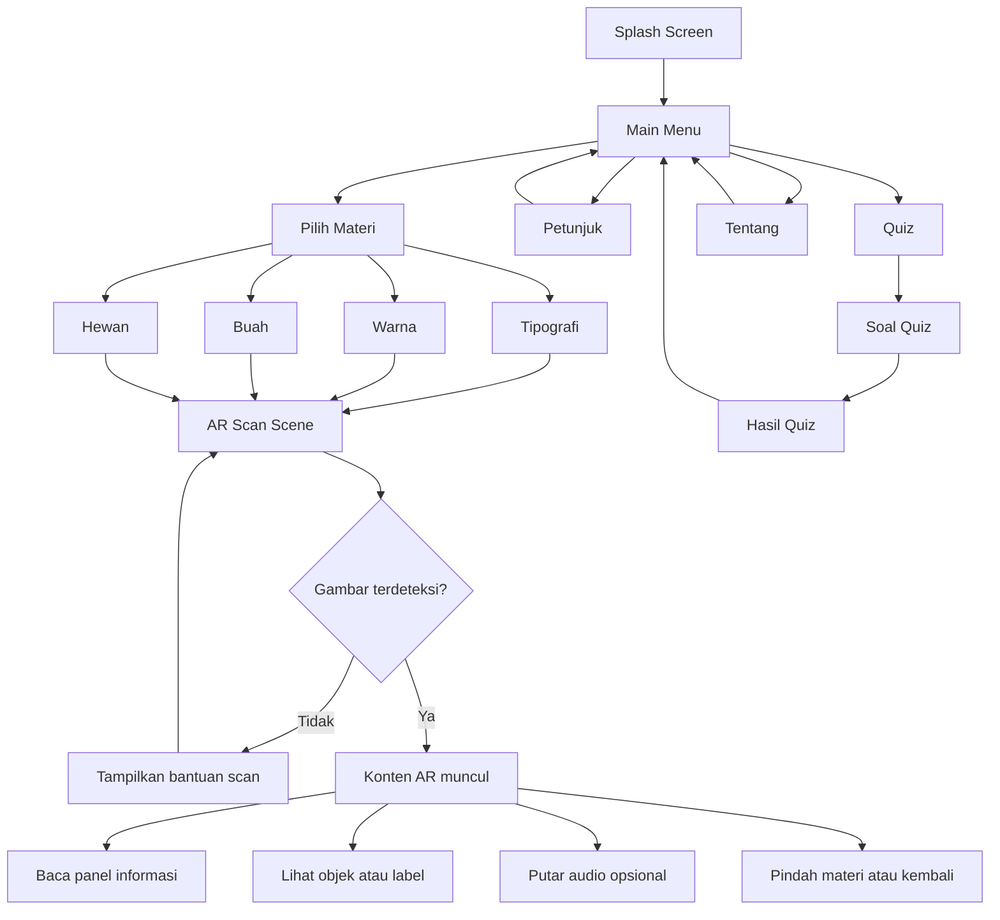

# AR Project UJIKOM — Media Pembelajaran Tipografi dan Warna Berbasis AR

## 1. Identitas Proyek

**Judul proyek:** Perancangan Media Pembelajaran Tipografi dan Warna Berbasis Augmented Reality sebagai Pendukung Pembelajaran Desain Grafis Percetakan  
**Kategori UJIKOM:** Desain Grafis Percetakan  
**Platform target:** Android  
**Engine:** Unity 6.4  
**Framework AR:** AR Foundation  
**Tracking approach:** Tracked Image / Image Tracking  
**Runtime Android:** ARCore  
**Fokus materi:** Tipografi, warna, objek pendukung berupa buah dan hewan  
**Target pengguna:** Siswa SD akhir, SMP, pemula desain, guru, dan penguji UJIKOM

Proyek ini dirancang sebagai **media pembelajaran interaktif** yang menggabungkan **media cetak** dan **aplikasi AR Android**. Media cetak berisi materi visual, ilustrasi, dan area gambar referensi. Aplikasi AR membaca gambar referensi tersebut menggunakan **image tracking** dari **AR Foundation**, lalu menampilkan konten digital berupa objek 3D, label, panel informasi, audio, dan interaksi belajar.

Konsep ini tetap sangat cocok untuk **Desain Grafis Percetakan** karena karya utamanya tetap bisa dibuktikan dalam bentuk **poster, kartu edukasi, atau lembar pembelajaran cetak**, sementara AR berfungsi sebagai media pendukung yang memperkaya pengalaman belajar.

---

## 2. Koreksi Konsep Teknis

Karena proyek ini memakai **AR Foundation**, maka istilah teknis yang tepat adalah:

- **Bukan:** Vuforia marker-based database
- **Yang tepat:** **Tracked image AR / image tracking**

Secara praktik, pengguna tetap memindai **poster, kartu, atau lembar cetak**. Bedanya, pengenalan gambar dilakukan oleh **AR Foundation + ARCore**, bukan Vuforia.

Artinya:

- Poster/kartu cetak tetap relevan
- Desain cetak tetap menjadi aset utama
- Kamera mendeteksi gambar referensi yang sudah dimasukkan ke **XR Reference Image Library**
- Saat gambar dikenali, Unity memunculkan konten AR yang terpasang pada gambar tersebut

---

## 3. Latar Belakang Masalah

Pembelajaran tipografi dan warna sering terasa abstrak jika hanya dijelaskan lewat teks atau gambar statis. Banyak siswa memahami bentuk visual secara dangkal, tetapi belum mengerti:

- apa itu anatomi huruf,
- bagaimana jenis huruf memengaruhi karakter desain,
- bagaimana kontras warna memengaruhi keterbacaan,
- mengapa RGB dan CMYK berbeda,
- bagaimana warna bekerja pada objek nyata.

Masalah utamanya:

- Materi terlalu teoritis jika hanya dibaca.
- Media cetak informatif tetapi tidak interaktif.
- Materi visual sulit melekat jika tidak diberi pengalaman eksplorasi.
- Siswa lebih cepat tertarik pada media yang bergerak, muncul, dan dapat diamati langsung.

Solusi proyek ini adalah membuat **aplikasi AR pembelajaran** yang menjembatani teori desain dasar dengan visual interaktif melalui pemindaian gambar cetak.

---

## 4. Tujuan Proyek

### 4.1 Tujuan Umum

Membuat media pembelajaran desain grafis percetakan berbasis AR yang membantu pengguna memahami tipografi dan warna dengan cara yang lebih visual, interaktif, dan mudah dipresentasikan.

### 4.2 Tujuan Khusus

- Menjelaskan dasar tipografi secara visual.
- Menjelaskan dasar warna secara kontekstual.
- Menghubungkan teori warna dengan objek nyata seperti buah dan hewan.
- Menghasilkan karya yang tetap relevan dengan bidang percetakan.
- Menunjukkan kemampuan perencanaan UI, UX, produksi visual, implementasi Unity, dan build Android.

---

## 5. Value Proposition

Nilai kuat proyek ini ada pada empat hal:

1. **Relevan dengan jurusan** karena ada hasil desain cetak nyata.
2. **Ada unsur inovasi** karena materi divisualisasikan lewat AR.
3. **Cocok untuk demo UJIKOM** karena mudah dipresentasikan langsung.
4. **Mudah dipahami penguji** karena alurnya sederhana: pilih materi → scan gambar → materi muncul.

---

## 6. Ruang Lingkup

### 6.1 In Scope

- Splash screen
- Main menu
- Halaman petunjuk
- Halaman pilih materi
- Halaman scan AR
- Overlay panel edukasi
- Materi tipografi
- Materi warna
- Materi buah
- Materi hewan
- Kuis sederhana
- Halaman hasil kuis
- Halaman tentang aplikasi
- Build APK Android offline

### 6.2 Out of Scope

- Login akun
- Database online
- Sinkronisasi cloud
- Leaderboard online
- Multiplayer
- Backend server
- Fitur gesture kompleks berlebihan
- Konten 3D yang terlalu berat

### 6.3 Target MVP

Minimal yang harus selesai:

- 1 aplikasi Android
- 1 main menu
- 2 materi inti: **Tipografi** dan **Warna**
- minimal 4 tracked image aktif
- 1 panel informasi yang sinkron dengan konten
- 1 kuis sederhana
- 1 build APK yang stabil untuk demo

Versi ideal:

- 8 tracked image
- 4 kategori materi
- audio penjelasan singkat
- animasi ringan
- transisi UI rapi

---

## 7. Target Pengguna

### 7.1 Target Utama

- Siswa usia 11–16 tahun
- Pemula desain grafis
- Guru/pembimbing
- Penguji UJIKOM

### 7.2 Persona

#### Persona A — Siswa Pemula
- Ingin belajar tanpa merasa materi terlalu berat
- Lebih mudah memahami visual dibanding teori panjang
- Butuh tombol dan alur yang sederhana

#### Persona B — Pembimbing / Penguji
- Ingin melihat hubungan antara karya cetak dan aplikasi
- Menilai kestabilan aplikasi, alur presentasi, dan kualitas desain
- Butuh hasil yang jelas, tidak bertele-tele, dan dapat didemokan cepat

---

## 8. Learning Outcome

Setelah menggunakan aplikasi, pengguna diharapkan bisa:

### Tipografi
- Memahami pengertian tipografi
- Mengenali anatomi huruf dasar
- Membedakan serif, sans serif, script, dan display
- Memahami hierarki teks sederhana
- Memahami keterbacaan dasar pada media cetak

### Warna
- Memahami warna primer, sekunder, dan tersier
- Memahami warna hangat dan dingin
- Memahami kontras dan harmoni warna
- Mengetahui perbedaan RGB dan CMYK

### Penguatan melalui objek
- Menghubungkan warna dengan objek nyata
- Mengamati kombinasi warna alami pada buah dan hewan
- Mengaitkan visual objek dengan nuansa desain

---

## 9. Struktur Materi

## 9.1 Materi Inti

### A. Tipografi
Submateri:

1. Pengertian tipografi  
2. Anatomi huruf  
3. Jenis huruf  
4. Hierarki teks  
5. Keterbacaan pada desain cetak

### B. Warna
Submateri:

1. Pengertian warna  
2. Primer, sekunder, tersier  
3. Hangat dan dingin  
4. Kontras dan harmoni  
5. RGB vs CMYK

## 9.2 Materi Pendukung

### C. Buah
- Apel
- Pisang
- Jeruk
- Anggur

Tujuan:
- Menjelaskan asosiasi warna melalui objek nyata.
- Memudahkan identifikasi warna dominan.

### D. Hewan
- Kucing
- Burung beo
- Ikan badut
- Kupu-kupu

Tujuan:
- Menunjukkan variasi warna alami.
- Menjelaskan harmoni dan kontras warna lewat visual yang familiar.

---

## 10. UX Strategy

Aplikasi ini harus mengutamakan **kejelasan**, **kecepatan penggunaan**, dan **minim kebingungan**.

### 10.1 Prinsip UX

- Pengguna harus bisa masuk ke fungsi utama dalam maksimal 3 langkah.
- Tiap layar hanya punya satu fokus utama.
- AR screen harus langsung menjelaskan apa yang harus dilakukan.
- Pesan bantuan harus singkat dan operasional.
- Panel informasi tidak boleh menutupi objek AR terlalu banyak.
- Tombol utama harus konsisten posisi dan bentuknya.
- Konten pembelajaran harus terasa visual-first, bukan text-first.

### 10.2 UX Goals

- Pengguna memahami fungsi aplikasi dalam 10 detik pertama.
- Pengguna bisa mulai scan tanpa bertanya ulang.
- Pengguna tahu apa yang terjadi saat gambar berhasil terdeteksi.
- Pengguna tahu apa yang harus dilakukan saat deteksi gagal.

### 10.3 Pain Point yang Harus Dihindari

- UI terlalu ramai
- terlalu banyak menu sebelum AR aktif
- panel informasi terlalu besar
- teks terlalu panjang di layar scan
- tombol terlalu kecil
- transisi lambat
- tracked image sulit dikenali karena desain cetak buruk

---

## 11. UI Strategy

### 11.1 Gaya Visual

Tema visual yang direkomendasikan:

- modern edukatif
- bersih
- ramah pelajar
- tidak terlalu kekanak-kanakan
- tetap punya nuansa desain grafis

### 11.2 Palet UI

Saran arah palet:

- Background: putih / off-white / abu muda
- Primary button: biru / cyan
- Secondary button: kuning / oranye
- Success: hijau lembut
- Error: merah lembut
- Accent materi: bisa mengambil warna CMYK atau primer edukatif

### 11.3 Font UI

Saran:

- Heading: Poppins / Montserrat / Nunito Bold
- Body: Inter / Open Sans / Nunito Regular
- Font dekoratif hanya dipakai di **materi tipografi**, bukan UI utama

### 11.4 Hierarki Visual

- Judul halaman jelas
- tombol utama lebih besar dari tombol sekunder
- kategori ditampilkan sebagai card
- panel informasi memakai background semi transparan
- ikon kategori harus mudah dibedakan

---

## 12. Informasi Arsitektur Produk

Struktur pengalaman utama:

1. Splash Screen
2. Main Menu
3. Petunjuk
4. Pilih Materi
5. Scan AR
6. Overlay Materi AR
7. Quiz
8. Hasil Quiz
9. Tentang

Relasi antarhalaman:

- Main Menu → Pilih Materi
- Main Menu → Petunjuk
- Main Menu → Quiz
- Main Menu → Tentang
- Pilih Materi → Scan AR
- Scan AR → Overlay Materi AR
- Quiz → Hasil Quiz → Main Menu

---

## 13. UI Flow



---

## 14. User Flow Detail

### 14.1 Main User Flow

1. Pengguna membuka aplikasi.
2. Splash screen tampil singkat.
3. Masuk ke main menu.
4. Pengguna menekan **Mulai Belajar**.
5. Masuk ke halaman **Pilih Materi**.
6. Pengguna memilih kategori, misalnya **Tipografi**.
7. Scene AR dibuka.
8. Kamera aktif dan instruksi scan muncul.
9. Pengguna mengarahkan kamera ke poster/kartu referensi.
10. Unity mendeteksi gambar melalui **ARTrackedImageManager**.
11. Konten AR muncul di atas gambar referensi.
12. Overlay panel menampilkan nama materi dan penjelasan singkat.
13. Pengguna dapat melihat materi lain, kembali, atau membuka kuis.

### 14.2 Error Flow

Jika gambar belum terdeteksi:

- tampilkan status **"Arahkan kamera ke gambar referensi"**
- tampilkan tips pencahayaan
- tampilkan tips jarak ideal
- tombol **Bantuan** tetap tersedia

Jika tracking hilang:

- objek AR dapat di-hide atau diturunkan intensitasnya
- status berubah menjadi **"Tracking hilang, arahkan kembali ke gambar"**

---

## 15. Desain Layar per Halaman

## 15.1 Splash Screen

### Tujuan
Membangun identitas awal aplikasi.

### Elemen
- Logo aplikasi
- Nama aplikasi
- identitas pembuat/sekolah opsional
- animasi fade in sederhana

### Catatan UX
- maksimal 2–3 detik
- tidak perlu interaksi

---

## 15.2 Main Menu

### Elemen
- Logo / nama aplikasi
- Tombol **Mulai Belajar**
- Tombol **Petunjuk**
- Tombol **Quiz**
- Tombol **Tentang**
- Tombol **Keluar**

### Layout
- header di atas
- tombol menu vertikal di tengah
- footer kecil berisi versi aplikasi

### Catatan UX
- tombol besar dan konsisten
- jangan lebih dari 5 opsi utama

---

## 15.3 Halaman Petunjuk

### Isi
1. Pilih materi  
2. Buka kamera AR  
3. Arahkan ke gambar referensi  
4. Tunggu konten muncul  
5. Pelajari isi materinya

### Elemen
- ilustrasi 3 langkah
- teks singkat
- tombol kembali

---

## 15.4 Halaman Pilih Materi

### Kategori
- Tipografi
- Warna
- Buah
- Hewan

### Layout
Gunakan:
- **card grid 2x2** untuk tampilan ringkas, atau
- **vertical cards** jika ingin ruang teks lebih besar

### Isi tiap card
- ikon/thumbnail
- judul kategori
- deskripsi satu kalimat
- tombol pilih

---

## 15.5 Halaman Scan AR

### Fungsi
Menjadi layar utama pengalaman AR.

### Elemen
- camera feed fullscreen
- top bar kecil
- status text
- overlay frame guide
- tombol bantuan
- tombol kembali/home
- panel info kecil yang bisa expand

### Catatan UX
- kamera harus dominan
- instruksi jangan lebih dari 1–2 baris
- status tracking harus terlihat jelas

---

## 15.6 Overlay Materi AR

### Elemen
- judul materi
- deskripsi singkat
- tombol info detail
- tombol audio
- tombol next/back
- indikator kategori

### Layout disarankan
- panel bawah model **bottom sheet** semi-transparan
- tombol horizontal di bawah panel
- area tengah tetap bersih untuk objek AR

---

## 15.7 Halaman Quiz

### Format
- pilihan ganda
- 5 soal
- satu soal per layar

### Elemen
- nomor soal
- pertanyaan
- 4 pilihan
- progress bar
- tombol next

### Catatan UX
- setelah memilih, beri state benar/salah
- jawaban terkunci setelah dipilih

---

## 15.8 Halaman Hasil

### Elemen
- skor akhir
- kategori hasil
- tombol ulangi quiz
- tombol kembali ke menu

---

## 15.9 Halaman Tentang

### Isi
- judul proyek
- tujuan aplikasi
- nama pembuat
- jurusan/sekolah
- tools yang digunakan
- versi aplikasi

---

## 16. UX State Design

### Empty State
Pesan: **"Pilih materi untuk memulai"**

### Loading State
Pesan: **"Menyiapkan AR..."**

### Scanning State
Pesan: **"Arahkan kamera ke gambar referensi"**

### Tracking Success State
Pesan: **"Materi ditemukan"**

### Tracking Lost State
Pesan: **"Tracking hilang, arahkan kembali ke gambar"**

### Error State
Pesan: **"Gambar belum terbaca. Coba pencahayaan lebih terang dan jarak 20–40 cm"**

---

## 17. Rancangan Pengalaman AR per Materi

## 17.1 Tipografi

### Image 1 — Anatomi Huruf
Saat gambar referensi terbaca, muncul huruf besar 3D atau panel huruf dengan label:

- ascender
- descender
- stem
- serif
- baseline
- counter

Interaksi:
- toggle label
- info singkat
- audio narasi opsional

### Image 2 — Jenis Huruf
Muncul contoh:
- Serif
- Sans Serif
- Script
- Display

Interaksi:
- tombol bandingkan
- tombol info karakter huruf

### Image 3 — Hierarki Teks
Muncul mini layout poster:
- Judul
- Subjudul
- Body text
- Highlight

Tujuan:
- Menjelaskan perbedaan skala, penekanan, dan struktur bacaan.

---

## 17.2 Warna

### Image 4 — Roda Warna
Menampilkan roda warna dengan penjelasan:
- primer
- sekunder
- tersier
- hangat
- dingin

### Image 5 — Kontras Warna
Menampilkan dua contoh mini desain:
- kontras kuat
- kontras lemah

Tujuan:
- Menjelaskan keterbacaan dan pemilihan warna.

### Image 6 — RGB vs CMYK
Menampilkan dua panel:
- RGB untuk layar
- CMYK untuk cetak

Tujuan:
- Menghubungkan materi ke konteks percetakan.

---

## 17.3 Buah

Contoh tracked image untuk objek:
- Apel → merah/hijau
- Pisang → kuning
- Jeruk → oranye
- Anggur → ungu

Tujuan:
- Menjelaskan warna dominan dan asosiasi visual.

---

## 17.4 Hewan

Contoh tracked image:
- Kucing
- Burung beo
- Ikan badut
- Kupu-kupu

Tujuan:
- Menunjukkan harmoni warna alami.
- Menjelaskan karakter visual melalui warna dan pola.

---

## 18. Desain Aset Cetak untuk Image Tracking

Karena memakai AR Foundation, kualitas **gambar referensi** sangat menentukan tracking.

### 18.1 Media Cetak yang Bisa Dipakai

- poster A3 / A4
- flash card A5
- lembar materi
- booklet mini

### 18.2 Karakteristik Gambar Referensi yang Baik

- punya detail visual banyak
- kontras baik
- tidak blur
- tidak terlalu banyak area kosong
- tidak repetitif berlebihan
- tidak terlalu reflektif saat dicetak
- tiap gambar harus cukup berbeda satu sama lain

### 18.3 Struktur Visual yang Disarankan

Untuk setiap gambar referensi:

- ilustrasi utama yang unik
- bentuk visual jelas
- area tekstur/detail cukup kaya
- warna pembeda kategori kuat
- judul kecil boleh ada, tetapi jangan mendominasi keseluruhan

### 18.4 Catatan Penting

Jangan membuat kartu terlalu polos. Tracking AR Foundation lebih baik pada gambar dengan banyak fitur visual yang bisa dikenali sistem.

---

## 19. Functional Requirements

### 19.1 Fungsional

1. Aplikasi menampilkan splash screen.
2. Aplikasi menampilkan main menu.
3. Pengguna dapat membuka petunjuk.
4. Pengguna dapat memilih kategori materi.
5. Aplikasi dapat membuka kamera AR.
6. Aplikasi dapat mendeteksi gambar referensi dari image library.
7. Aplikasi menampilkan konten AR sesuai gambar yang dikenali.
8. Aplikasi menampilkan panel informasi sesuai materi.
9. Pengguna dapat kembali ke halaman sebelumnya.
10. Pengguna dapat mengerjakan quiz.
11. Aplikasi menghitung skor.
12. Aplikasi menampilkan hasil quiz.
13. Aplikasi dapat berjalan offline setelah asset dibundel.

### 19.2 Non-Fungsional

1. UI harus jelas pada layar Android.
2. Waktu load harus singkat.
3. Tracking cukup stabil di cahaya normal indoor.
4. Semua fitur inti berjalan tanpa internet.
5. Build harus cukup ringan untuk demo.
6. Font dan panel harus tetap terbaca saat kamera aktif.

---

## 20. Stack Teknis Unity

## 20.1 Stack Utama

- **Unity 6.4**
- **AR Foundation**
- **XR Plug-in Management**
- **ARCore XR Plugin**
- **TextMeshPro**
- **Unity UI (Canvas)**
- **Animator** untuk animasi ringan
- **AudioSource** untuk narasi dan SFX

## 20.2 Paket yang Perlu Dipasang

Minimal:

- `AR Foundation`
- `XR Plug-in Management`
- `ARCore XR Plugin`
- `TextMeshPro`

Opsional:

- `Input System` jika ingin arsitektur input lebih rapi
- `Timeline` jika ingin intro/splash lebih halus

## 20.3 Konsep Runtime Android

Untuk Android, alur runtime yang disarankan:

- Unity menjalankan scene AR
- `AR Session` mengelola lifecycle sesi AR
- `AR Session Origin` / `XR Origin` menjadi root transform AR
- `AR Camera` menampilkan camera feed
- `ARTrackedImageManager` memonitor reference images
- saat reference image terdeteksi, script memunculkan prefab sesuai nama image

---

## 21. Struktur Scene

Rekomendasi scene:

1. `SplashScene`
2. `MainMenuScene`
3. `GuideScene`
4. `MaterialSelectScene`
5. `ARScanScene`
6. `QuizScene`
7. `ResultScene`
8. `AboutScene`

Alternatif yang lebih ringkas:

- 1 scene menu besar + panel
- 1 scene AR
- 1 scene quiz/result

Namun untuk UJIKOM, scene terpisah biasanya lebih mudah dijelaskan saat presentasi.

---

## 22. Struktur Folder Project

```text
Assets/
├── Art/
│   ├── UI/
│   ├── Icons/
│   ├── ReferenceImages/
│   ├── Posters/
│   ├── Textures/
│   └── Fonts/
├── Audio/
│   ├── BGM/
│   ├── SFX/
│   └── Narration/
├── Materials/
├── Models/
│   ├── Typography/
│   ├── Fruits/
│   └── Animals/
├── Prefabs/
│   ├── UI/
│   ├── AR/
│   └── Quiz/
├── Scenes/
├── Scripts/
│   ├── Core/
│   ├── UI/
│   ├── AR/
│   ├── Quiz/
│   └── Data/
├── ScriptableObjects/
└── Resources/
```

---

## 23. Hierarchy `ARScanScene`

Contoh hierarchy yang rapi:

```text
ARScanScene
├── EventSystem
├── Systems
│   ├── AppStateManager
│   └── AudioManager
├── XR Origin
│   └── AR Camera
├── AR Session
├── AR Managers
│   ├── ARTrackedImageManager
│   ├── ARRaycastManager (opsional)
│   └── ARPlaneManager (tidak wajib, bisa nonaktif)
├── AR Content Root
│   ├── Typography_Anatomy_Prefab
│   ├── Typography_FontTypes_Prefab
│   ├── Typography_Hierarchy_Prefab
│   ├── ColorWheel_Prefab
│   ├── Contrast_Prefab
│   ├── RGB_CMYK_Prefab
│   ├── Fruit_Set_Prefab
│   └── Animal_Set_Prefab
├── Canvas_AROverlay
│   ├── TopBar
│   ├── StatusText
│   ├── BottomInfoPanel
│   ├── ActionButtons
│   └── HelpPopup
└── Environment Helpers
    └── Light/Debug helpers (opsional)
```

Catatan:
- Untuk image tracking murni, `ARPlaneManager` dan `ARRaycastManager` tidak wajib aktif.
- Fokus utamanya adalah `ARTrackedImageManager`.

---

## 24. UI Flow Teknis di Scene AR

Saat `ARScanScene` dibuka:

1. `AR Session` aktif.
2. `ARTrackedImageManager` memuat `XR Reference Image Library`.
3. Status text menampilkan instruksi scan.
4. Kamera mendeteksi gambar referensi.
5. Event `trackedImagesChanged` dipicu.
6. Sistem mencari prefab yang cocok.
7. Prefab di-spawn atau diaktifkan.
8. `InfoPanelController` mengisi judul, deskripsi, dan ikon.
9. Jika tracking hilang, state panel berubah sesuai kebijakan.

Kebijakan yang disarankan:
- Saat tracking hilang singkat, prefab tetap dipertahankan beberapa saat.
- Jika tracking benar-benar hilang, tampilkan status lost tracking.

---

## 25. Script Architecture

## 25.1 Core Scripts

### `SceneLoader.cs`
Tugas:
- load scene
- back ke menu
- exit app

### `AppStateManager.cs`
Tugas:
- menyimpan kategori aktif
- menyimpan pengaturan audio on/off
- menyimpan skor quiz sementara

### `AudioManager.cs`
Tugas:
- SFX klik
- BGM menu
- narasi materi

---

## 25.2 UI Scripts

### `MainMenuController.cs`
Tugas:
- binding semua tombol menu

### `GuidePageController.cs`
Tugas:
- mengatur halaman petunjuk

### `MaterialSelectionController.cs`
Tugas:
- memilih kategori
- menyimpan state kategori
- pindah ke scene AR

### `InfoPanelController.cs`
Tugas:
- mengisi title
- short description
- icon
- expand/collapse detail

### `TrackingStatusUI.cs`
Tugas:
- update teks status scan
- menampilkan state success/lost/error

---

## 25.3 AR Scripts

### `TrackedImageContentManager.cs`
Tugas:
- subscribe ke `ARTrackedImageManager.trackedImagesChanged`
- mencocokkan nama reference image dengan prefab
- mengaktifkan / menonaktifkan konten AR

### `TrackedImageBinding.cs`
Tugas:
- menyimpan pasangan `referenceImageName` ↔ `prefab`

### `TrackedContentController.cs`
Tugas:
- mengatur state konten saat tracked / limited / lost
- update posisi dan rotasi sesuai tracked image

### `ObjectRotateController.cs`
Tugas:
- rotasi objek otomatis pelan
- atau rotasi via tombol

### `ARHelpController.cs`
Tugas:
- menampilkan popup bantuan scan

### `NarrationController.cs`
Tugas:
- memutar audio sesuai materi aktif

---

## 25.4 Quiz Scripts

### `QuizManager.cs`
Tugas:
- load soal
- simpan jawaban
- hitung skor

### `QuestionData.cs`
Tugas:
- struktur data soal

### `ResultController.cs`
Tugas:
- tampilkan skor dan kategori hasil

---

## 26. Struktur Data yang Direkomendasikan

Gunakan **ScriptableObject** untuk memisahkan data dari logika.

### `MaterialData.cs`

```csharp
using UnityEngine;

[CreateAssetMenu(fileName = "MaterialData", menuName = "ARProject/Material Data")]
public class MaterialData : ScriptableObject
{
    public string id;
    public string title;
    public string category;
    public string referenceImageName;

    [TextArea] public string shortDescription;
    [TextArea] public string longDescription;

    public Sprite icon;
    public AudioClip narration;
    public GameObject contentPrefab;
}
```

### `QuestionData.cs`

```csharp
using UnityEngine;

[CreateAssetMenu(fileName = "QuestionData", menuName = "ARProject/Question Data")]
public class QuestionData : ScriptableObject
{
    [TextArea] public string question;
    public string[] choices = new string[4];
    public int correctIndex;
}
```

---

## 27. Mapping Reference Image ke Konten

| Ref Image ID | Kategori | Konten AR | Output Edukasi |
|---|---|---|---|
| IMG01 | Tipografi | Anatomi huruf | Label bagian huruf |
| IMG02 | Tipografi | Jenis huruf | Serif, Sans, Script, Display |
| IMG03 | Tipografi | Hierarki teks | Judul, subjudul, body |
| IMG04 | Warna | Roda warna | Primer, sekunder, tersier |
| IMG05 | Warna | Kontras warna | Kombinasi warna terbaca/tidak |
| IMG06 | Warna | RGB vs CMYK | Layar vs cetak |
| IMG07 | Buah | Apel/Jeruk/Pisang | Asosiasi warna objek |
| IMG08 | Hewan | Burung/Kupu-kupu/Ikan | Harmoni warna alami |

---

## 28. Konten Teks Materi Singkat

### Anatomi Huruf
Anatomi huruf adalah bagian-bagian pembentuk huruf. Dengan memahaminya, desainer lebih mudah memilih dan menggunakan huruf secara tepat.

### Jenis Huruf
Setiap jenis huruf memiliki karakter berbeda. Serif cenderung formal, sans serif terasa modern, script lebih dekoratif, dan display dipakai untuk penekanan visual.

### Roda Warna
Roda warna membantu memahami hubungan antarwarna, termasuk primer, sekunder, tersier, serta kombinasi harmonis.

### RGB dan CMYK
RGB digunakan untuk layar digital, sedangkan CMYK digunakan untuk kebutuhan cetak. Perbedaan ini penting dalam desain grafis percetakan.

---

## 29. Desain Interaksi

### Interaksi Wajib
- tap tombol
- pilih kategori
- scan gambar referensi
- tampilkan info
- pindah materi
- kerjakan quiz

### Interaksi Tambahan yang Bagus
- toggle label anatomi
- audio narasi
- animasi pop-in saat konten muncul
- auto-rotate objek ringan

### Interaksi yang Sebaiknya Dihindari
- drag bebas 3D kompleks
- pinch zoom rumit
- popup bertumpuk
- gesture multitouch banyak state

---

## 30. Aset yang Dibutuhkan

## 30.1 Aset UI
- logo aplikasi
- background menu
- tombol
- card kategori
- panel informasi
- progress bar quiz
- ikon bantuan/audio/home/back

## 30.2 Aset AR
- model huruf 3D / panel tipografi
- label anatomi huruf
- roda warna
- panel RGB/CMYK
- model buah sederhana
- model hewan sederhana

## 30.3 Aset Audio
- SFX klik
- SFX tracking success ringan
- narasi materi singkat
- BGM menu opsional

## 30.4 Aset Cetak
- poster utama
- kartu/image reference per materi
- versi mockup untuk presentasi

---

## 31. Pipeline Produksi

### Tahap 1 — Perencanaan
- finalisasi judul
- finalisasi target pengguna
- finalisasi daftar materi
- wireframe UI
- storyboard user flow

### Tahap 2 — Produksi Visual
- desain logo
- desain UI utama
- desain poster/kartu image reference
- siapkan ilustrasi dan ikon

### Tahap 3 — Setup Unity 6.4
- buat project Unity 6.4
- aktifkan Android build support
- install AR Foundation
- install XR Plug-in Management
- install ARCore XR Plugin
- buat scene dan struktur folder

### Tahap 4 — Implementasi AR
- buat `XR Reference Image Library`
- masukkan semua gambar referensi
- pasang `ARTrackedImageManager`
- hubungkan image name ke prefab konten
- bangun panel info dan status tracking

### Tahap 5 — Implementasi Konten
- integrasi materi tipografi
- integrasi materi warna
- integrasi materi buah/hewan
- integrasi audio jika ada

### Tahap 6 — Implementasi Quiz
- buat soal
- UI quiz
- halaman hasil

### Tahap 7 — Testing dan Optimasi
- uji tracking
- uji performa Android
- uji UI
- uji semua tombol
- optimasi model, texture, audio

### Tahap 8 — Finalisasi
- build APK
- siapkan poster/kartu cetak
- siapkan script presentasi demo

---

## 32. Wireframe Teks Sederhana

## 32.1 Main Menu

```text
+----------------------------------+
|         AR EDU LEARNING          |
|    Tipografi & Warna Interaktif  |
|                                  |
|      [ Mulai Belajar ]           |
|      [ Petunjuk ]                |
|      [ Quiz ]                    |
|      [ Tentang ]                 |
|      [ Keluar ]                  |
|                                  |
|           Versi 1.0              |
+----------------------------------+
```

## 32.2 Pilih Materi

```text
+----------------------------------+
|           Pilih Materi           |
|                                  |
|   [ Tipografi ]  [ Warna ]       |
|   [ Buah ]       [ Hewan ]       |
|                                  |
|          [ Kembali ]             |
+----------------------------------+
```

## 32.3 Scan AR

```text
+----------------------------------+
| < Back          Scan Materi      |
|                                  |
|        [  Camera Preview  ]      |
|          [ Frame Guide ]         |
|                                  |
| Arahkan ke gambar referensi      |
|                                  |
|   [ Bantuan ]       [ Home ]     |
+----------------------------------+
```

## 32.4 Overlay Materi AR

```text
+----------------------------------+
| < Back         Materi Aktif      |
|                                  |
|         [ Konten AR Muncul ]     |
|                                  |
| +------------------------------+ |
| | Judul Materi                | |
| | Deskripsi singkat materi    | |
| +------------------------------+ |
|                                  |
| [Info] [Audio] [Next] [Home]     |
+----------------------------------+
```

---

## 33. Storyboard Singkat

### Scene 1
Splash screen tampil dengan logo aplikasi.

### Scene 2
Main menu muncul. Pengguna memilih **Mulai Belajar**.

### Scene 3
Pengguna memilih kategori **Tipografi**.

### Scene 4
Scene AR terbuka. Kamera aktif dan meminta pengguna mengarahkan kamera ke gambar referensi.

### Scene 5
Gambar referensi terdeteksi. Konten anatomi huruf muncul.

### Scene 6
Pengguna membaca panel informasi dan mencoba materi lain.

### Scene 7
Pengguna membuka quiz untuk mengukur pemahaman.

### Scene 8
Hasil quiz muncul. Pengguna kembali ke menu utama.

---

## 34. Rekomendasi Implementasi Unity 6.4

### 34.1 Prinsip Teknis

- Jangan gabungkan seluruh konten berat ke satu prefab raksasa.
- Buat pairing image ↔ prefab secara terstruktur.
- Pisahkan data materi dari logika UI.
- Buat panel info universal, bukan satu panel per materi.
- Prioritaskan kestabilan tracking dibanding efek visual berlebihan.

### 34.2 Optimasi Mobile

- pakai texture sedang
- gunakan low-poly model untuk buah/hewan
- compress audio
- hindari shadow real-time berat
- gunakan material sederhana
- matikan manager AR yang tidak perlu

### 34.3 Pengaturan Android

- Platform: Android
- Orientation: Portrait
- Camera permission: wajib
- ARCore support: aktif
- Min SDK sesuaikan perangkat uji
- semua asset utama dibundel offline

### 34.4 Pengaturan AR Foundation yang Praktis

Untuk proyek ini, cukup fokus pada:
- `AR Session`
- `XR Origin`
- `AR Camera`
- `ARTrackedImageManager`

Tidak perlu memaksakan:
- plane placement
- point cloud visualization
- raycast interaction

Karena kebutuhan utama proyek ini adalah **scan gambar cetak → munculkan konten edukasi**.

---

## 35. Checklist Implementasi

## 35.1 UI
- [ ] Splash screen selesai
- [ ] Main menu selesai
- [ ] Petunjuk selesai
- [ ] Pilih materi selesai
- [ ] AR overlay selesai
- [ ] Quiz selesai
- [ ] Result selesai
- [ ] Tentang selesai

## 35.2 AR Foundation
- [ ] AR Foundation terpasang
- [ ] XR Plug-in Management aktif
- [ ] ARCore XR Plugin aktif
- [ ] XR Reference Image Library dibuat
- [ ] Semua gambar referensi dimasukkan
- [ ] `ARTrackedImageManager` berfungsi
- [ ] Prefab muncul sesuai image
- [ ] Panel info sinkron dengan materi
- [ ] Status tracking tampil benar

## 35.3 Konten
- [ ] Materi tipografi siap
- [ ] Materi warna siap
- [ ] Materi buah siap
- [ ] Materi hewan siap
- [ ] Narasi siap jika digunakan

## 35.4 Testing
- [ ] Uji di Android asli
- [ ] Uji pencahayaan terang
- [ ] Uji pencahayaan sedang
- [ ] Uji jarak dekat dan sedang
- [ ] Uji seluruh tombol
- [ ] Uji perpindahan scene
- [ ] Uji quiz sampai hasil

---

## 36. Testing Scenario

### Skenario 1 — Navigasi Dasar
- buka aplikasi
- masuk main menu
- buka petunjuk
- kembali
- buka tentang
- kembali

**Expected:** semua navigasi normal.

### Skenario 2 — Tracking Tipografi
- pilih tipografi
- arahkan kamera ke gambar anatomi huruf
- amati konten muncul
- buka panel info

**Expected:** konten yang benar muncul dan info sinkron.

### Skenario 3 — Tracking Warna
- pilih warna
- scan gambar roda warna
- cek panel penjelasan

**Expected:** materi warna muncul dengan benar.

### Skenario 4 — Tracking Lost
- setelah objek muncul, jauhkan kamera
- lihat perubahan status

**Expected:** sistem memberi feedback tracking hilang.

### Skenario 5 — Quiz
- jawab semua soal
- cek hasil akhir

**Expected:** skor dan kategori hasil benar.

---

## 37. Risiko dan Mitigasi

| Risiko | Dampak | Mitigasi |
|---|---|---|
| Gambar referensi kurang detail | tracking gagal | desain image reference dengan detail visual tinggi |
| Objek 3D terlalu berat | aplikasi lag | gunakan low-poly dan texture ringan |
| UI terlalu penuh | pengguna bingung | batasi elemen per layar |
| Tracking hilang saat demo | pengalaman buruk | siapkan pencahayaan dan cetakan yang baik |
| Terlalu banyak fitur | pengerjaan molor | prioritaskan MVP |
| Asset tidak konsisten | proyek terasa mentah | pakai style guide dan naming convention |

---

## 38. Kriteria Internal Agar Proyek Kuat Saat UJIKOM

### 38.1 Relevansi Jurusan
- ada poster/kartu cetak
- materi membahas tipografi dan warna
- ada hubungan langsung ke desain grafis percetakan

### 38.2 Inovasi
- pembelajaran berbasis AR
- image tracking terintegrasi ke media cetak

### 38.3 UI/UX
- alur sederhana
- tombol jelas
- konten mudah dipahami
- tampilan bersih

### 38.4 Teknis
- tracking cukup stabil
- build APK lancar
- tidak banyak bug saat demo

---

## 39. Strategi Demo Saat Presentasi

Urutan demo yang efektif:

1. Tunjukkan poster atau kartu cetak.
2. Jelaskan bahwa itu adalah hasil desain percetakan sekaligus image reference AR.
3. Buka aplikasi Android.
4. Tunjukkan main menu dan petunjuk singkat.
5. Masuk ke materi tipografi.
6. Scan satu image reference tipografi.
7. Tunjukkan panel info dan jelaskan anatomi huruf.
8. Masuk ke materi warna.
9. Scan image reference warna.
10. Jelaskan RGB vs CMYK dan kaitannya dengan cetak.
11. Tunjukkan quiz.
12. Tutup dengan manfaat aplikasi sebagai media belajar interaktif.

---

## 40. Saran Nama APK

Nama APK sebaiknya:

- mudah dibaca penguji
- relevan dengan isi materi
- tidak terlalu panjang
- tetap punya identitas projek

### Opsi Nama yang Paling Layak

1. **ARtiGraf**  
   Makna: gabungan AR + tipografi/grafis. Pendek, mudah diingat, terasa modern.

2. **TeraARna**  
   Makna: tipografi + warna + AR. Lebih unik, tapi sedikit lebih konseptual.

3. **TypoColor AR**  
   Langsung menjelaskan isi aplikasi. Aman dan jelas untuk penguji.

4. **AR Grafika Belajar**  
   Kesan edukatif dan formal. Cocok untuk presentasi sekolah.

5. **CETAKAR**  
   Pendek dan kuat. Menyiratkan percetakan + AR.

6. **Belajar Desain AR**  
   Sangat jelas, mudah dipahami, tetapi lebih umum.

7. **ARnaTipe**  
   Gabungan warna + tipe/tipografi. Cukup unik dan khas.

8. **GrafikaAR Edu**  
   Terdengar formal dan edukatif.

### Rekomendasi Final

Jika ingin nama yang paling aman untuk UJIKOM:

- **TypoColor AR**
- **AR Grafika Belajar**
- **Belajar Desain AR**

Jika ingin nama yang lebih khas dan punya identitas:

- **ARtiGraf**
- **CETAKAR**
- **ARnaTipe**

### Saran Terbaik untuk Proyekmu

Pilihan paling seimbang:

**ARtiGraf**

Alasan:
- singkat
- mudah diingat
- terasa seperti nama aplikasi sungguhan
- tetap berhubungan dengan grafika/desain
- tidak terlalu generik

Alternatif kedua yang sangat aman untuk penguji:

**TypoColor AR**

---

## 41. Nama Package Android yang Disarankan

Contoh package name:

- `com.z7.artigraf`
- `com.z7.typocolorar`
- `com.sekolah.artigraf`
- `com.ujikom.artigraf`

Gunakan yang sederhana dan konsisten dengan nama APK.

---

## 42. Kesimpulan Implementasi

Arah teknis terbaik untuk proyek ini adalah:

- **Unity 6.4**
- **AR Foundation**
- **Android + ARCore**
- **image tracking berbasis poster/kartu cetak**
- **UI sederhana, AR fokus, materi jelas**

Dengan pendekatan ini, proyek tetap kuat dari sisi:

- jurusan percetakan,
- inovasi teknologi,
- kemudahan build,
- kemudahan demo,
- dan kejelasan penilaian saat UJIKOM.
